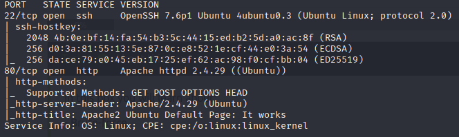
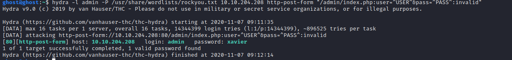
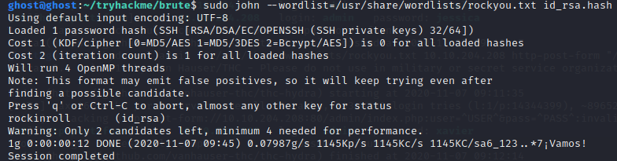
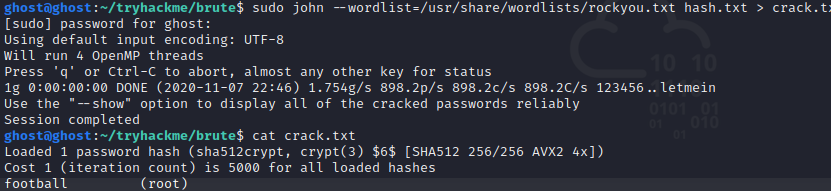

<h1> Brute It </h1>

Room: Brute It

Link: https://tryhackme.com/room/bruteit

Machine IP: 10.10.204.208

### Reconnaissance

Now starting with an nmap scan we see that there are 2 open ports, port 80 and 22.
   
  

The nmap gives us answer for our first 4 questions.

And we find a hidden directory named admin from the directory scan.

### Getting a shell
Now looking into the admin we see a login panel, checking the source code gives us the username admin.
So ,now we can bruteforce the login panel using hydra.
   
   

Now after logging into the admin panel of the web page we see our web flag "THM{brut3_f0rce_is_e4sy}" and also our id rsa key for user john.

Using the wget command we download the id_rsa file and now we have to crack it using john but first we have to convert it into a hash and for that we use the command: python /usr/share/john/ssh2john.py id_rsa > id_rsa.hash
 
 And now using john for cracking this hash.
    
   

 The passphrase is rockinroll

Logging into ssh via the above found credentials but first of all we have to change our id_rsa files permissions for that we type 'chmod 600 id_rsa'.
    
 crack.txt

And we have completed the room brute it. 
